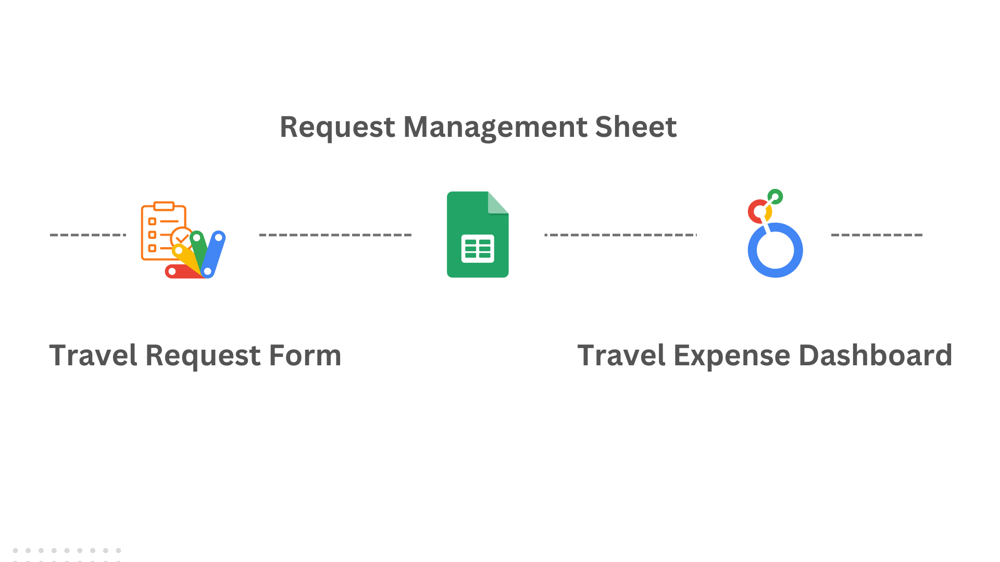
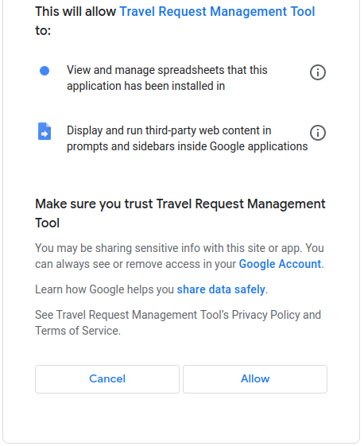
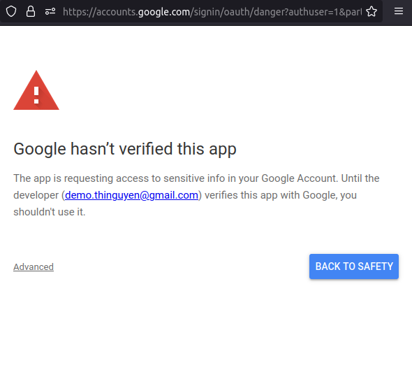

# Travel Request Management Tool | GAS Automation Project

## Introduction

The Travel Request Management Tool is an application developed with Google Apps Script that allows the Office Management to efficiently receive and manage internal business inquiries. 

The tool is basically designed to automate the manual workflow, where, for instance, the Office Management might receive requests via emails and then track the associated bookings or costs in a spreadsheet.

This system is pretty good at handling up to 1000 requests per day, which can be a cost-effective solution for start-ups or SMEs.

In this simplified version, there are no email alerts or approval flows, but these features can be added to enhance functionality.

## Architecture 

## Components

You can check out the tool using the links below:

- [Travel Request Form](https://script.google.com/macros/s/AKfycbxS5zYZKkVoUK4JmvTg_swFCuTaghi6VxtzLsxX4Bzt1E1eHlPt42Ah-8Xah-JuX0RlvA/exec){:target="_blank" rel="noopener"}
- [Request Management G-Sheet](https://docs.google.com/spreadsheets/d/1KfND3g4JSEKm70cDcEZSWpTZHOB5dSV_58JacnMXt2k){:target="_blank" rel="noopener"}
- [Travel Expense Dashboard](https://lookerstudio.google.com/reporting/a4809999-064d-49b6-ba9d-f9d4c2560a9c){:target="_blank" rel="noopener"}

[Demo video](https://drive.google.com/file/d/1kDp19loDwlOwoL7Khlt5Y2S3zVFnkhsh/view?usp=sharing){:target="_blank" rel="noopener"}

### A note on app authorization

You can fully access the travel request form and expense dashboard through your browser.

To try out the custom functionality of G-Sheet, make sure that you grant permission for Google Apps Script the first time you use it. This is a necessary step for any GAS application, as specified in the official documentation: [Authorization for Google Services](https://developers.google.com/apps-script/guides/services/authorization). Please review the app's scopes and choose "Allow" as in the below picture:

Since I use my personal G-account to host this app, a warning prompt might appear as below. You need not worry, as the permission is solely limited to the G-Sheet. Please click on "Advanced" to move forward. There will be no warning signs if you're using Google Workspace accounts.

## Technology Used
- [Web App | Apps Script](https://developers.google.com/apps-script/guides/web){:target="_blank" rel="noopener"}
- HTML5
- [Bootstrap 4](https://getbootstrap.com/docs/4.6/getting-started/introduction/){:target="_blank" rel="noopener"}
- [jQuery Steps](http://www.jquery-steps.com/){:target="_blank" rel="noopener"}
- [Google Sheets API](https://developers.google.com/sheets/api/reference/rest){:target="_blank" rel="noopener"}
- [Locker Studio](https://lookerstudio.google.com){:target="_blank" rel="noopener"}
